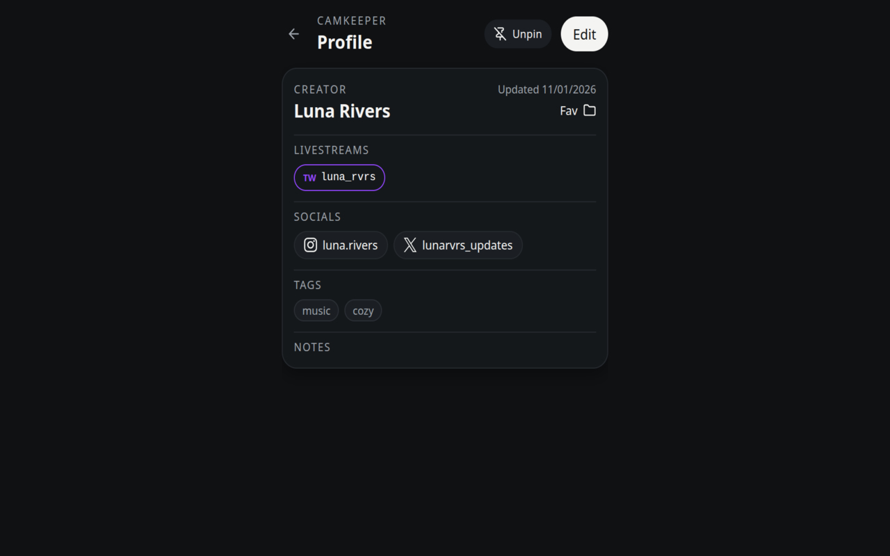

  
  <h1>CamKeeper</h1>
  <strong>Cross-site creator profile manager</strong>
  

      <a href="https://addons.mozilla.org/firefox/addon/camkeeper/">Firefox</a>
  

  

  
  
  

 

  

 

CamKeeper is a browser extension that helps you organize and manage creator profiles you save across multiple platforms.

It allows you to create a single local profile that can reference multiple usernames or pages on different platforms, making it easier to keep notes, links, and metadata in one place.

No accounts. No cloud services. All data remains on your device.

## Features

### Unified profiles

- One local profile can reference multiple sites
- Attach multiple usernames or URLs to a single profile
- Add notes, tags, and external links

### Page detection

- Detects supported pages automatically (configurable in settings)
- Default support for Twitch and YouTube
- Customize site labels, abbreviations, and colors in settings
- Shows saved profile details when revisiting a known page

### Organization & management

- Folder-based organization with filtering
- Sorting by name, view time, or last updated
- Bulk actions for merging or deleting profiles

### Local activity indicators

- Local tracking of view time for saved livestream pages
- All activity data is stored only in the browser

### Privacy-first design

- Local-only storage (no accounts, no sync)
- No analytics, tracking, or telemetry
- No external servers or third-party services
- Optional JSON export/import for backup or migration

## Usage

1. Visit a supported creator profile page
2. Click the CamKeeper extension icon to save or attach it to a profile
3. Organize profiles using folders, tags, and notes
4. View saved details automatically when revisiting pages

### Keyboard shortcuts

- Open popup: `Alt + Shift + K`
- Quick add current page: `Alt + Shift + S`

Shortcuts can be customized in the browser's extension settings.

## Installation

<!-- - [Add to Chrome]()-->
- [Add to Firefox](https://addons.mozilla.org/firefox/addon/camkeeper/)

Manual installation

#### Chrome / Chromium

1. Download `camkeeper-{{version}}-chrome.zip` from [Releases](https://github.com/byshabito/camkeeper/releases/latest)
2. Extract the archive
3. Open `chrome://extensions`
4. Enable **Developer mode**
5. Click **Load unpacked** and select the extracted folder

#### Firefox

1. Download `camkeeper-{{version}}-firefox.zip` from [Releases](https://github.com/byshabito/camkeeper/releases/latest)
2. Open `about:addons`
3. Go to **Extensions**
4. Click the gear icon and select **Install Add-on From File…**
5. Select the `.zip` file

**Note**: You may require the following `about:config` settings for Manifest V3 extensions:

- `xpinstall.signatures.required = false`
- `extensions.manifestV3.enabled = true`
- `extensions.backgroundServiceWorker.enabled = true`

These changes are not required on standard Firefox release builds when installing a signed add-on.

## Data & privacy

- All data is stored locally in the browser
- No data is transmitted or shared
- Data can be exported or imported at any time

See [PRIVACY](/PRIVACY.md) for full details.

## License

[GPL-3.0-or-later](/LICENSE)
