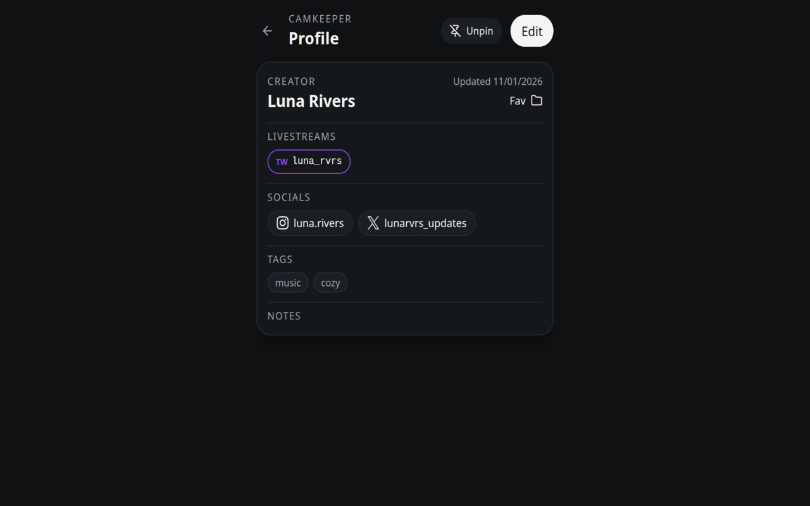

## What CamKeeper does

CamKeeper helps you manage creator profiles across sites from one extension popup.
You can save profiles, attach multiple site identities, track local view time for configured livestream sites, and quickly find people again later.

## Quick start

1. Visit a supported creator profile page.
2. Click the CamKeeper extension icon.
3. Save the creator as a new profile, or attach the page to an existing profile.
4. Add notes, tags, and folders to keep everything organized.

## Keyboard shortcuts

- Open popup: `Alt + Shift + K`
- Quick add current page: `Alt + Shift + S`

You can customize shortcuts in your browser extension settings.

## Local-only by default

CamKeeper stores profile data and settings in browser extension storage on your device.
It does not send your profile data to external servers.

Read the full policy here: [Privacy Policy](/privacy/)

Need help? Visit [Support](/support/)
